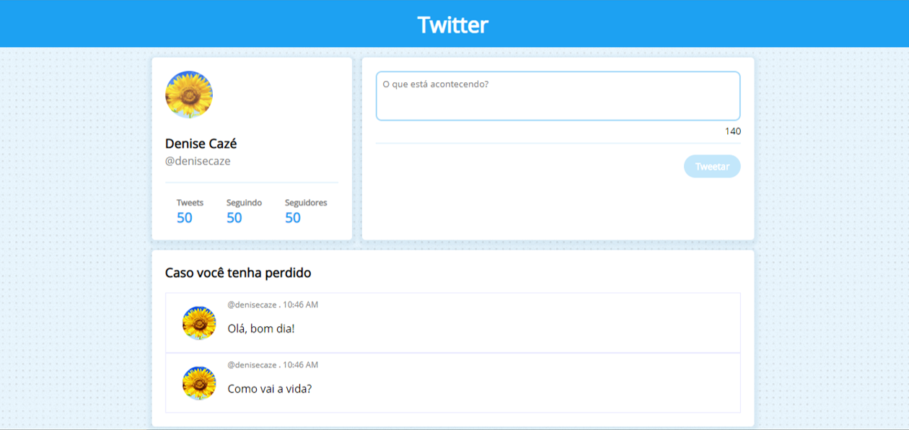

# Twitter
A website for posting messages.

## Motivation
This was a challenge of the second sprint of Laboratoria bootcamp. The requirement was to create a simplified desktop version of Twitter, and it had to have a post field with a counter of characters and a timeline where you can see these messages. 

## Appearance

## Technology Stack
+ HTML5
+ CSS3
+ JavaScript 

